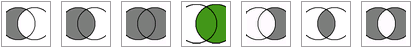

# Общее описание

Обработка Консоль сравнения данных (КСД) предназначена для сравнения данных из следующих источников:
* текущая база 1С 8
* база 1С 8 (через COM)
* база 1С 7.7 (через COM) (только файловая)
* база данных SQL (MS, Postgre и др., для которых есть драйвер)
* формата CSV
* формата TXT
* формата DBF
* формата XLS
* формата XML
* документ на форме обработки

### Алгоритм работы с обработкой при заполнении «с нуля»:
1. Выбор операции реляционной алгебры (левое соединения, пересечение и т.д.) в верхней части формы
1. При необходимости настройка общих параметров на вкладке **_Общие настройки -> Основные_**:  числа столбцов в ключе (по умолчанию установлено значение 1), строк для прерывания чтения (по умолчанию установлено значение 2), 
установка флага вывода типов столбцов ключа, указание пути к файлу выгрузки.
1. Настройка периода на вкладке **_Общие настройки -> Основные_** при необходимости
1. Настройка источника данных А
1. Настройка источника данных Б
1. Настройка условий вывода и запрета вывода строк таблицы расхождений на вкладках **_Общие настройки ->  Условия вывода строк_** и **_Общие настройки ->  Условия запрета вывода строк_**
1. Нажатие кнопки **_Сравнить данные_** или клавиши <F7>

# Настройка основных параметров

В верхней части формы находятся кнопки с изображениям кругов Эйлера, предназначенные для указания обработке, какую операцию реляционной алгебры применять для объединения данных из источников А и Б. Выбранная операция подсветится зеленым цветом:

Возможные операции:

| Картинка | Название операции в реляционной алгебре | Название операции в языке запросов 1С 8 | Название операции в языках SQL |
| ------------- | ------------- | ------------- | ------------- |
| Content Cell  | Content Cell  |||
| Content Cell  | Content Cell  |||